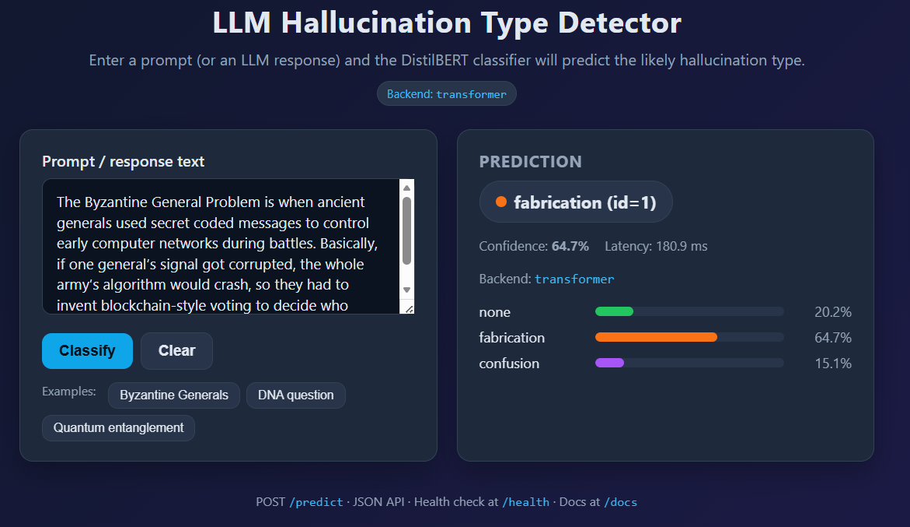
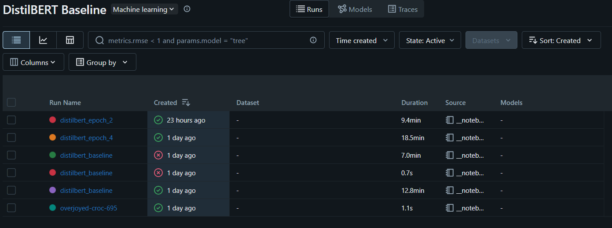
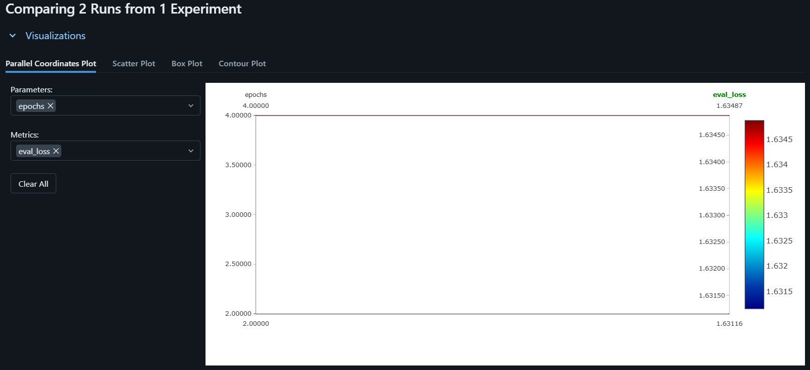

# LLM Hallucination Type Detector

> A fine-tuned **DistilBERT** classifier that labels an LLM prompt (or
> response) as **`none`**, **`fabrication`**, or **`confusion`**, served
> behind a FastAPI app with a small HTML UI.

[](#)
[](#)
[](#)
[](#experiment-tracking-with-mlflow--dagshub)
[](#run-with-docker)

---

## What this project does

Large language models hallucinate in different ways. This project builds a
**multi-class text classifier** that, given a prompt (or an LLM response),
predicts the *type* of hallucination likely to occur:

| Label id | Class name     | Meaning (informal)                                            |
| -------- | -------------- | ------------------------------------------------------------- |
| `0`      | `none`         | The answer should be factually sound.                         |
| `1`      | `fabrication`  | The model is likely to invent a non-existent entity / fact.   |
| `2`      | `confusion`    | The model is likely to conflate similar concepts / sources.   |

The training data is the public
**LLM Hallucination Benchmark v2 (≈25k rows, 6 models)**, restricted to
the three classes above and stratified into train / validation / test
(20 160 / 2 520 / 2 520 rows).

The model itself is `distilbert-base-uncased` with a 3-class classification
head, fine-tuned for 3 epochs. The full reproducible training run lives
in [`notebooks/poridhi-project-8-llm-hallucination.ipynb`](notebooks/poridhi-project-8-llm-hallucination.ipynb)
and the resulting checkpoint is shipped in
[`models/saved_distilbert_hallucination_model/`](models/saved_distilbert_hallucination_model).

### UI screenshot



The UI lets you paste a prompt, hit **Classify**, and see the predicted
label, confidence, per-class probability bars, inference latency, and
which backend (`transformer` or fallback `heuristic`) served the answer.

### Headline test-set metrics

| Metric                 | Value |
| ---------------------- | ----- |
| Accuracy               | **0.629** |
| Weighted F1            | **0.597** |
| Macro F1               | 0.429 |
| Weighted Precision     | 0.572 |
| Weighted Recall        | 0.629 |

> The “confusion” class is the minority (~11 % of rows) and is the hardest
> to learn with this small DistilBERT run — it’s the main reason macro-F1
> is noticeably lower than weighted-F1. Future work: class-weighted loss,
> more epochs, or a larger encoder (e.g. `roberta-base`).

---

## Project layout

```
.
├── run_api.py                     # convenience launcher (uvicorn src.api.main:app)
├── setup.py
├── requirements.txt
├── Dockerfile                     # multi-stage, CPU-only torch
├── docker-compose.yml
├── .dockerignore
├── data/                          # train_full / validation_full / test_full (CSVs)
├── models/
│   └── saved_distilbert_hallucination_model/
│       ├── config.json
│       ├── model.safetensors
│       ├── tokenizer.json
│       └── tokenizer_config.json
├── notebooks/
│   └── poridhi-project-8-llm-hallucination.ipynb   # full training + MLflow run
├── images/                        # screenshots for the README
│   ├── ui.png
│   ├── experiments-in-mlflow.png
│   └── comparison-of-2-runs.png
└── src/
    ├── api/                       # FastAPI app, schemas, inference
    │   ├── main.py
    │   ├── inference.py
    │   ├── schemas.py
    │   └── templates/index.html
    ├── data/make_dataset.py
    ├── features/build_features.py
    ├── model/
    │   ├── train_model.py
    │   └── predict_model.py
    └── visualization/visualize.py
```

---

## Experiment tracking with MLflow + DagsHub

Training is logged to a **DagsHub-hosted MLflow** instance, which gives a
git-backed model registry and a hosted MLflow UI for free.

The tracking snippet (from the training notebook) is short and explicit:

```python
import os
import mlflow
import dagshub
from kaggle_secrets import UserSecretsClient

dagshub_token = UserSecretsClient().get_secret("DAGSHUB_TOKEN1")
os.environ["MLFLOW_TRACKING_USERNAME"] = "ArpitaMallik"
os.environ["MLFLOW_TRACKING_PASSWORD"] = dagshub_token

dagshub.init(
    repo_owner="ArpitaMallik",
    repo_name="mlops-llm-hallucination-type-detection-project",
    mlflow=True,
)

mlflow.set_tracking_uri(
    "https://dagshub.com/ArpitaMallik/"
    "mlops-llm-hallucination-type-detection-project.mlflow"
)
mlflow.set_experiment("DistilBERT Baseline")

with mlflow.start_run(run_name="distilbert_baseline"):
    mlflow.log_param("model_name",  "distilbert-base-uncased")
    mlflow.log_param("epochs",      3)
    mlflow.log_param("batch_size",  16)
    mlflow.log_param("learning_rate", 2e-5)
    mlflow.log_param("max_length",  256)

    trainer.train()
    test_results = trainer.evaluate(test_dataset)   # returns a dict
    mlflow.log_metrics(test_results)                # eval_loss, eval_accuracy, eval_f1, ...
```

### What gets tracked

- **Parameters** — `model_name`, `epochs`, `batch_size`, `learning_rate`,
  `max_length`, plus anything else you log.
- **Metrics** — `eval_loss`, `eval_accuracy`, `eval_f1`, `eval_runtime`,
  `eval_samples_per_second` (whatever `Trainer.evaluate()` returns).
- **Artifacts** — model checkpoints produced by `Trainer` (via
  `save_strategy="epoch"`) and the final saved model in
  `saved_distilbert_hallucination_model/`.
- **Source** — the notebook itself, versioned by DagsHub’s git backend.

### Screenshots

The full MLflow experiment list:



Side-by-side comparison of two runs (the `distilbert_baseline` run and a
follow-up):



To browse them yourself:
<https://dagshub.com/ArpitaMallik/mlops-llm-hallucination-type-detection-project.mlflow>

---

## Run locally (no Docker)

```bash
git clone https://github.com/ArpitaMallik/mlops-llm-hallucination-type-detection-project.git
cd mlops-llm-hallucination-type-detection-project

python -m venv .venv
# Windows (PowerShell):
.venv\Scripts\Activate.ps1
# macOS / Linux:
# source .venv/bin/activate

pip install -r requirements.txt
pip install -e .

python run_api.py            # http://127.0.0.1:8000
```

Useful flags:

```bash
python run_api.py --host 0.0.0.0 --port 8000
python run_api.py --reload   # auto-reload on file changes
```

### Try the API

```bash
# Health / model info
curl http://localhost:8000/health

# JSON inference
curl -X POST http://localhost:8000/predict \
  -H "Content-Type: application/json" \
  -d '{"text": "What is the Byzantine Generals Problem?"}'
```

Sample response:

```json
{
  "label": "fabrication",
  "label_id": 1,
  "confidence": 0.78,
  "scores": { "none": 0.15, "fabrication": 0.78, "confusion": 0.07 },
  "model_backend": "transformer",
  "latency_ms": 42.7
}
```

### Useful endpoints

| Method | Path             | Purpose                                  |
| ------ | ---------------- | ---------------------------------------- |
| GET    | `/`              | HTML UI for quick testing                |
| GET    | `/health`        | Liveness + which backend is loaded       |
| POST   | `/predict`       | JSON inference: `{"text": "..."}`        |
| POST   | `/predict/form`  | HTML form submission used by the UI      |
| GET    | `/docs`          | Auto-generated Swagger UI                |

### Pointing the API at a different model

The inference layer reads the checkpoint path from the
`HALLUCINATION_MODEL_DIR` env var (default:
`models/saved_distilbert_hallucination_model`). If the directory is
missing or `transformers`/`torch` aren’t installed, the service transparently
falls back to a keyword-based `heuristic` backend so the UI is still usable.

---

## Run with Docker

The image is multi-stage. The first stage installs a **CPU-only** PyTorch
wheel (no CUDA, saves ~1.5 GB) plus the rest of the runtime deps; the
second stage copies the trained checkpoint and a slim `python:3.11-slim`
base into the final image. The API runs as a non-root user and exposes
`/health` for container healthchecks.

### Build the image

```bash
docker build -t hallucination-api:latest .
```

### Run with plain Docker

```bash
docker run --rm -p 8000:8000 --name hallucination-api hallucination-api:latest
```

Then open:

- UI: <http://localhost:8000/>
- Health: <http://localhost:8000/health>
- Docs: <http://localhost:8000/docs>

### Run with Docker Compose

```bash
docker compose up --build
```

To swap the checkpoint at runtime, uncomment the `volumes:` block in
[`docker-compose.yml`](docker-compose.yml) and rebuild — the host directory
will be mounted over `/app/models/saved_distilbert_hallucination_model`.

### Image size notes

- The CPU-only torch wheel from
  `https://download.pytorch.org/whl/cpu` is used to avoid shipping the
  ~1.5 GB of CUDA libraries.
- `.dockerignore` excludes `.venv/`, `data/`, `notebooks/`, `docs/`,
  `.git/`, etc., from the build context.

---

## Tech stack

- **Model:** DistilBERT (`distilbert-base-uncased`) via 🤗 Transformers
- **Training:** 🤗 `Trainer` + `datasets` + `evaluate`
- **Experiment tracking:** MLflow on DagsHub
- **Serving:** FastAPI + Uvicorn + Jinja2 templates
- **Packaging:** `setup.py` / `pip install -e .`
- **Containerization:** multi-stage Docker, CPU-only torch

---

## License

MIT — see [`LICENSE`](LICENSE).